# make-a-pretty-prompt-in-windows-terminal
This is intructions to make a pretty prompt in windows terminal
## Install
- **Install Windows Terminal free from the Microsoft Store**
- **Open Windows Terminal**

- **Install post-git via Windows Terminal**
```
Install-Module posh-git -Scope CurrentUser
```
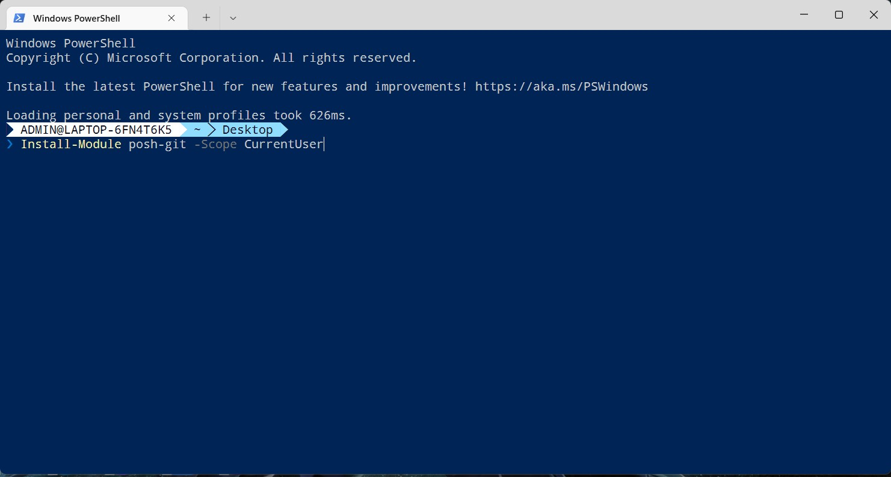
- **Install PowerShellGet**
```
Install-Module -Name PowerShellGet -Force
```
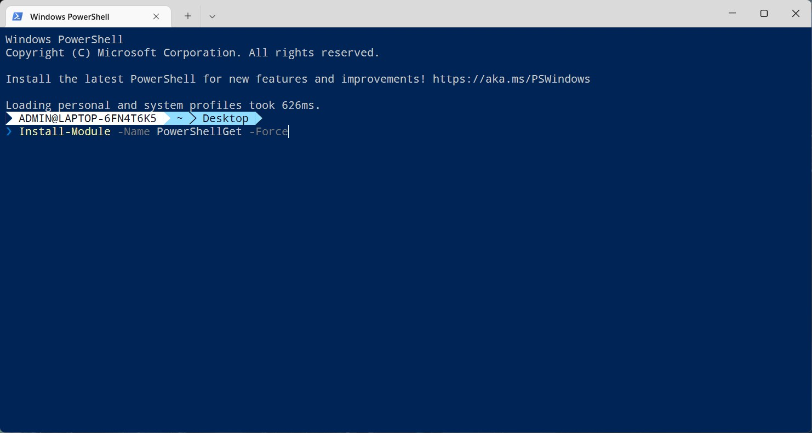
- **Install PSReadLine**
```
Install-Module -Name PSReadLine -Scope CurrentUser -Force -SkipPublisherCheck
```
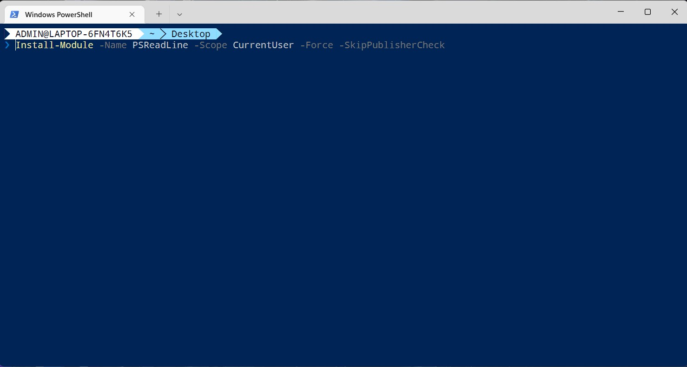
- **Install Scoop**
```
Set-ExecutionPolicy RemoteSigned -Scope CurrentUser
Invoke-WebRequest get.scoop.sh | Invoke-Expression
```
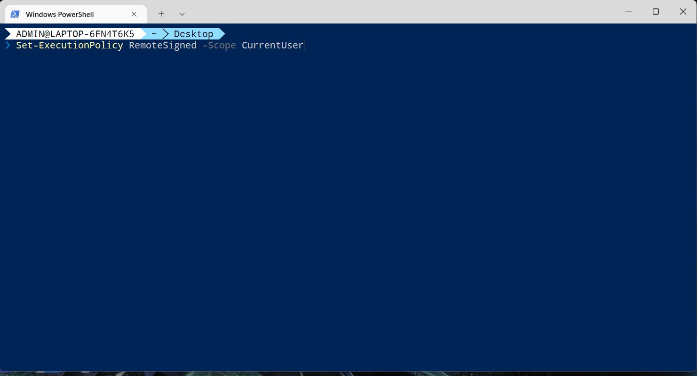
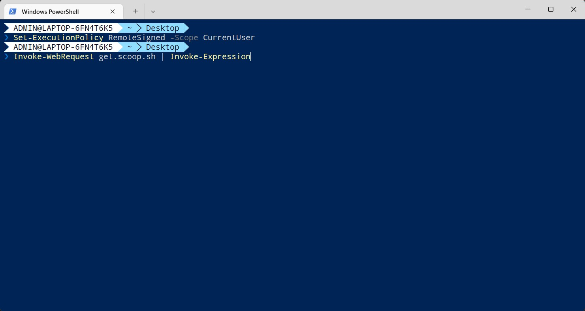
- [**Install Oh-my-post**](https://ohmyposh.dev/docs/installation/windows)
```
scoop install https://github.com/JanDeDobbeleer/oh-my-posh/releases/latest/download/oh-my-posh.json
```
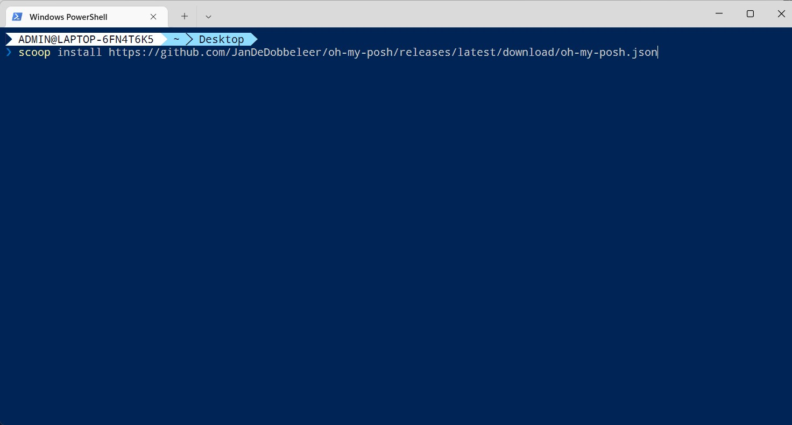
- Open default Profile
```
notepad $PROFILE
```
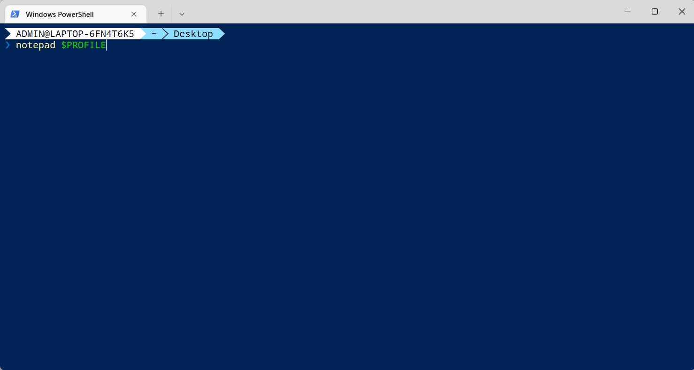
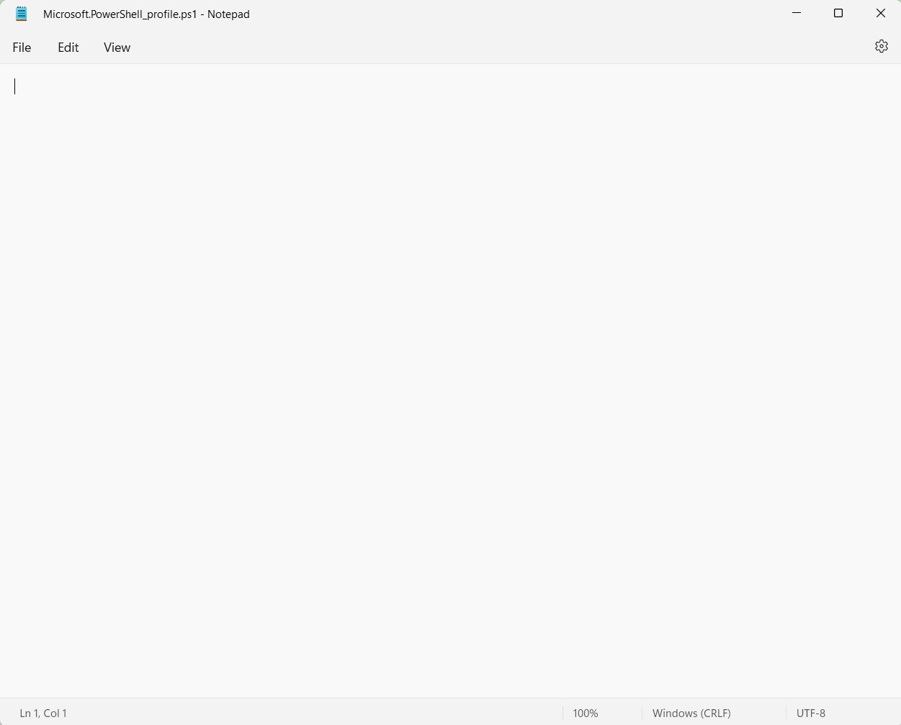
- **Copy/Paste commands below to notepad**
```
Import-Module posh-git
oh-my-posh init pwsh --config 'https://raw.githubusercontent.com/JanDeDobbeleer/oh-my-posh/main/themes/agnoster.omp.json' | Invoke-Expression

Set-PSReadLineOption -PredictionSource History
# Shows navigable menu of all options when hitting Tab
Set-PSReadlineKeyHandler -Key Tab -Function MenuComplete

# Autocompletion for arrow keys
Set-PSReadlineKeyHandler -Key UpArrow -Function HistorySearchBackward
Set-PSReadlineKeyHandler -Key DownArrow -Function HistorySearchForward
```
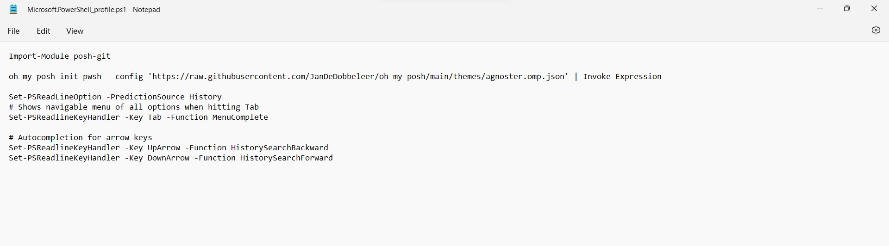
- **Restart your computer**
- **Install Powerline font from [Github](https://github.com/powerline/fonts)**
```
# clone
git clone https://github.com/powerline/fonts.git --depth=1
# install
cd fonts
./install.ps1
# clean-up a bit
cd ..
rm -rf fonts
```
- **Open Windows Terminal, then click down arrow and choose Settings**
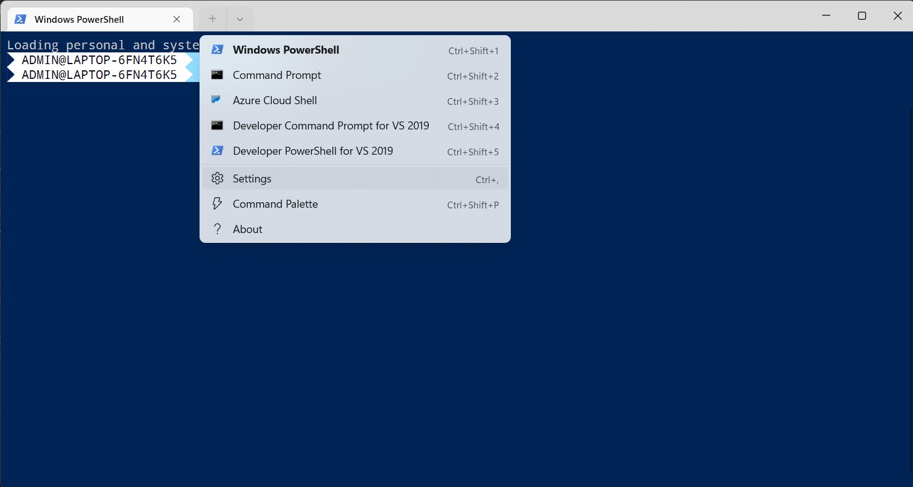
- **Choose Windows PowerShell**
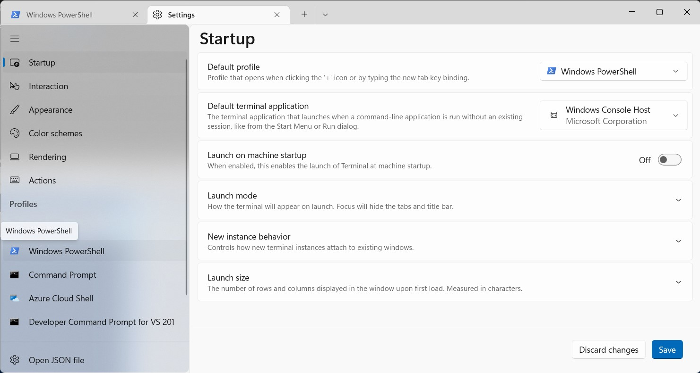
- **Scroll to Additional settings, then click Appearance**
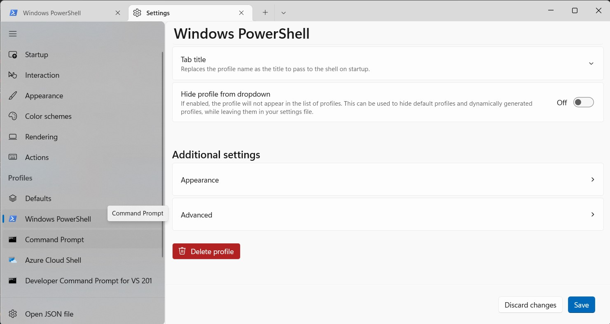
- **Choose font face (example: Noto Mono for Powerline) and font size (example: 12)**
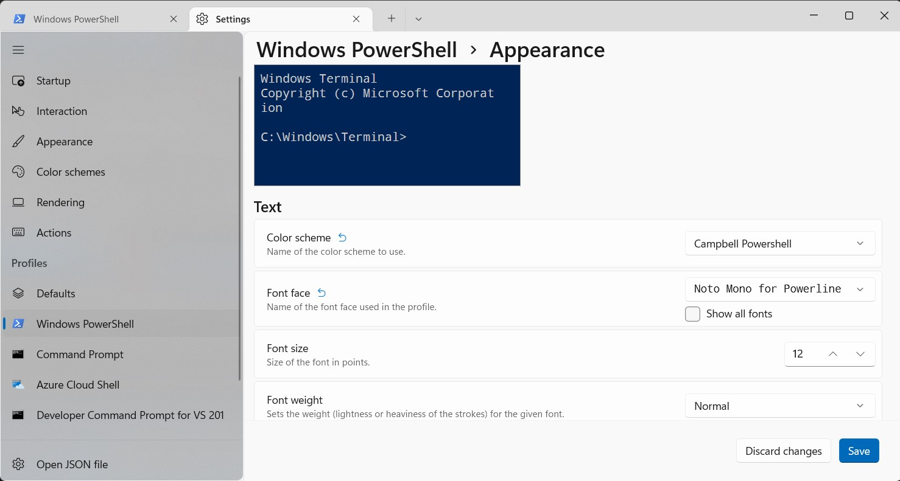
- **Click Save to save the settings**